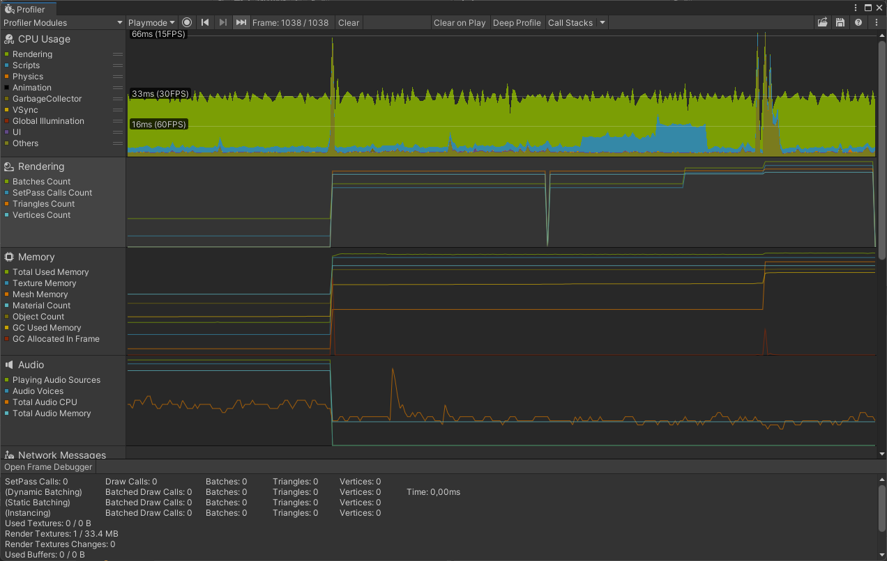
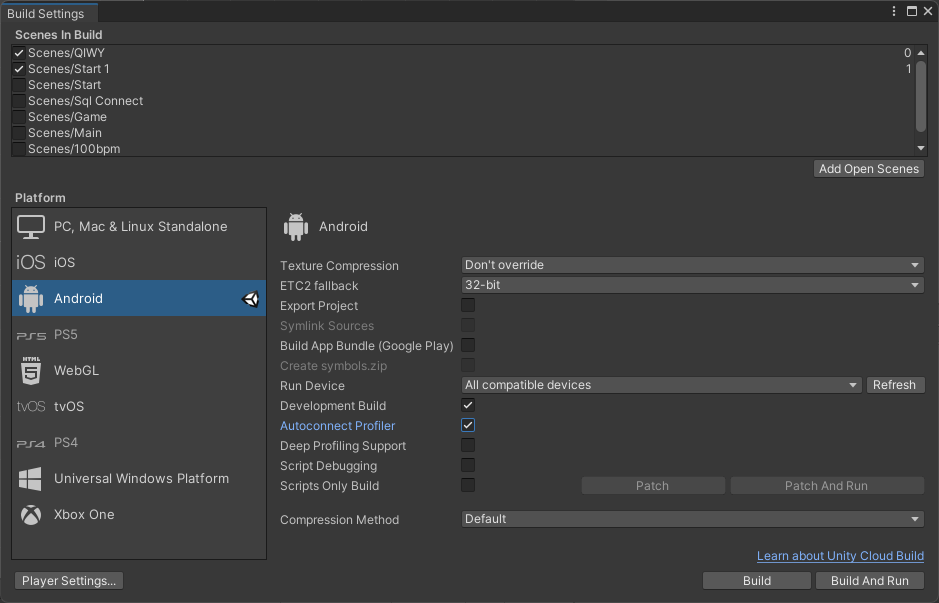

# Unity Performance Optimization - Part 1 : Profiling

 

Performance optimization is a real challenge for all videogames creators. Performances are even more important for Android or iOS projects. FPS drops, latency, lag, etc. disturb players's experience and discourage them to play once again. The variety and the wide selection of mobile devices combined with the diversity of hardaware and specification can make you giddy. This guide provides *Profiling, *UI*, *Rendering*, *Code Architecture* and *Global Unity* advices to develop a top performance 2D mobile game.

 > This part is focused on **Profiling**

Back to [Readme](../README.md) or go to [Unity Performance Optimization - Part 2 : UI](Unity-Performance-Optimization-Part2)

## Table of contents
* [Prerequisites](#prerequisites)
* [Profiling](#profiling)

## Prerequisites

* [Unity](https://unity3d.com/fr/get-unity/download) installed (ideally a LTS version) with the modules **Android SDK & NDK tools**, **OpenJDK** and **iOS Build Support**
* [USB debugging](https://developer.android.com/studio/debug/dev-options) or [Wireless debugging (Android 11+) or ADB over network enable (Android 10 and lower)](https://developer.android.com/studio/command-line/adb) enabled on the device

## Profiling

The Unity Profiler provides **essential performance information** about Unity applications. It allows to see graphically how a game is doing, what takes time to compute, how long is the rendering per frame and which sections are absorbing your performances.

The Profiler need to be used at the **beginning** of the project and **often**. A performance signature allows to the developper to spot new issues more easly.

	 
	<em>Unity Profiler window</em>

Profiling on **different devices** gives the opportunity to gain more **accurate insights**. It's important to profile and optimize for **both the highest and lowest** specifity devices targeted.

> WARNING
> 
> with the *Profiler* : 
> * if the **CPU** is slowing down, optimise **Shaders** won't increase the frame rate
> * if the **GPU** is slowing down, optimizing **Physic** or **Script** won't help at all

To display the Unity Profiler go to *Window > Profiler*. Then, build the application with **Development Build** and **Autoconnect profiler** enabled. Finally, connect the device to the computer, launch the Unity application on your device and press the button *Record* in the Profiler window.

	 
	<em>Build Settings options</em>

> WARNING
> 
> The **Autoconnect profiler** option can not work and avoid the connection between Unity and devices. If the Profiler doesn't detect devices, disable the **Autoconnect profiler** in Build Settings can correct this problem. However, devices should be **connect manually**.

To learn more about how to configure, use and interpret Unity Profiler, go read the article [Optimize your mobile game performance from Unity’s top engineers](https://blog.unity.com/technology/optimize-your-mobile-game-performance-tips-on-profiling-memory-and-code-architecture)

---

Back to [Readme](../README.md) or go to [Unity Performance Optimization - Part 2 : UI](Unity-Performance-Optimization-Part2)