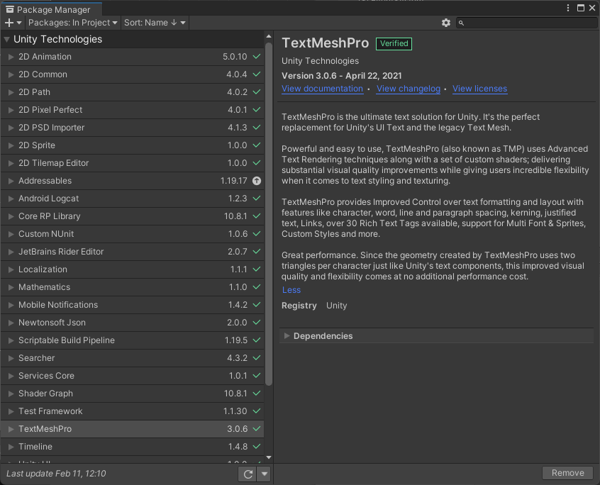
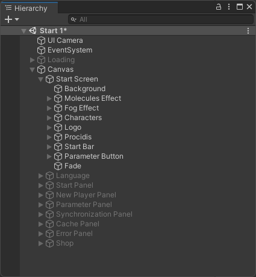
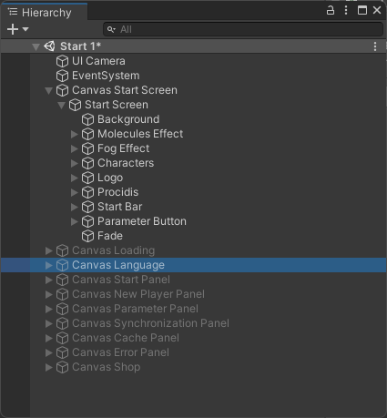
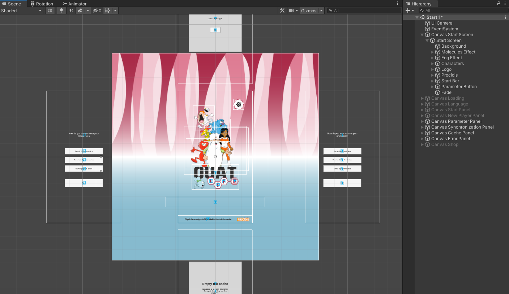
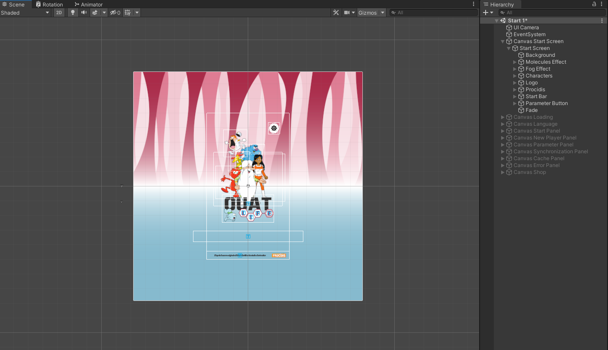
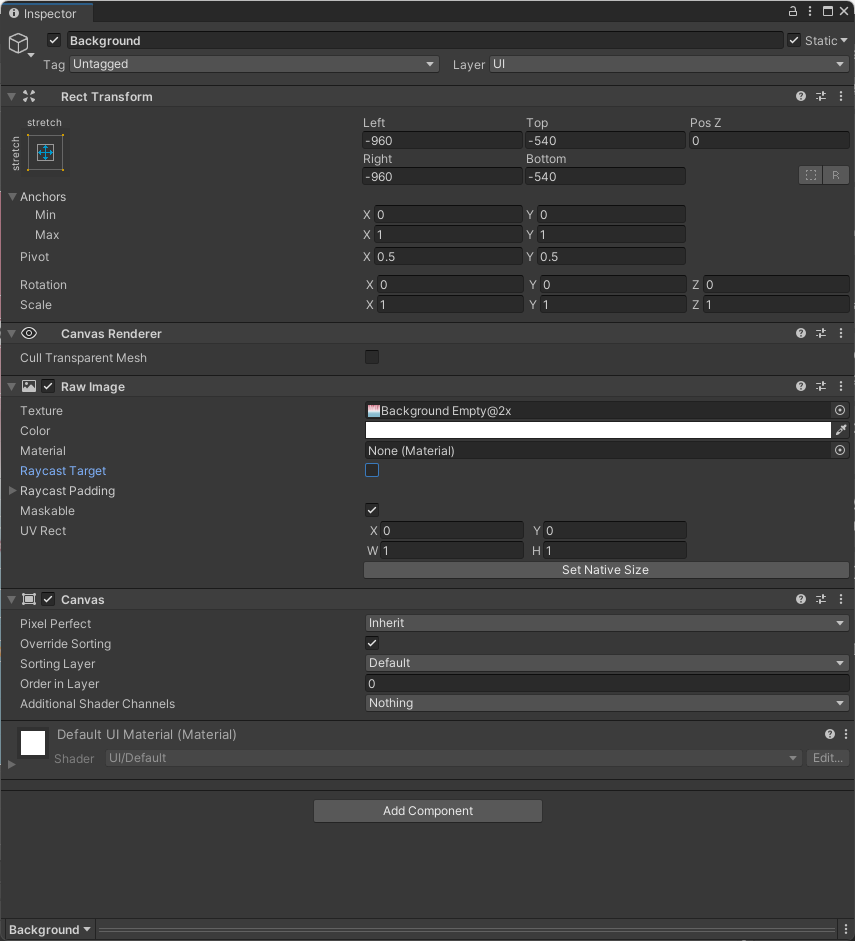
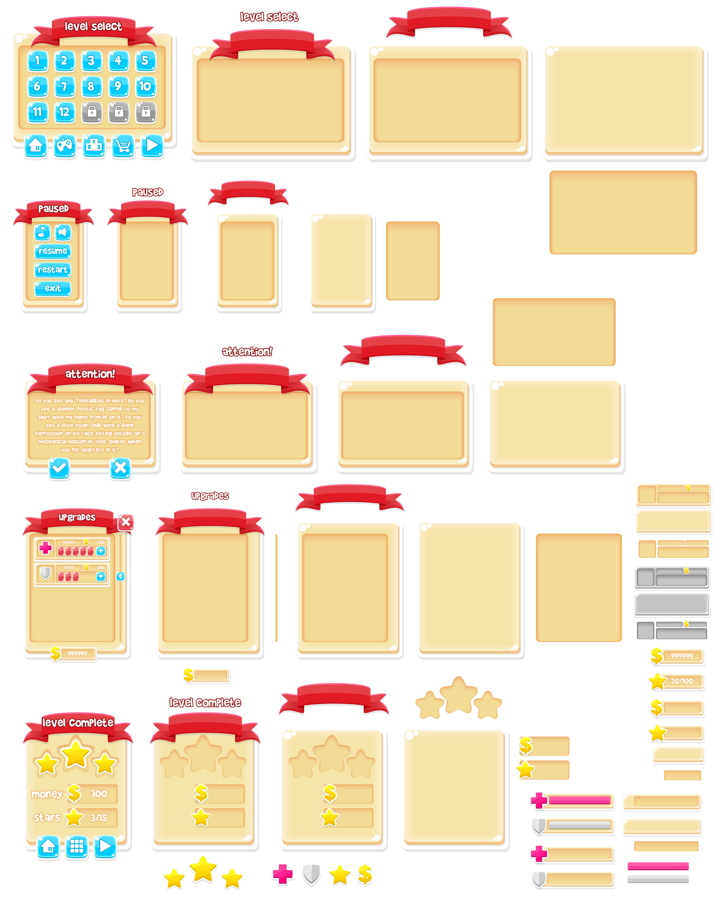

# Unity Performance Optimization - Part 2 : UI

 

Performance optimization is a real challenge for all videogames creators. Performances are even more important for Android or iOS projects. FPS drops, latency, lag, etc. disturb players's experience and discourage them to play once again. The variety and the wide selection of mobile devices combined with the diversity of hardaware and specification can make you giddy. This guide provides *Profiling, *UI*, *Rendering*, *Code Architecture* and *Global Unity* advices to develop a top performance 2D mobile game.

 > This part is focused on **Profiling**

Back to [Readme](../README.md) or go to [Unity Performance Optimization - Part 3 : Rendering](Unity-Performance-Optimization-Part3.md)

## Table of contents
* [Prerequisites](#prerequisites)
* [UI](#ui)

## Prerequisites

* [Unity](https://unity3d.com/fr/get-unity/download) installed (ideally a LTS version) with the modules **Android SDK & NDK tools**, **OpenJDK** and **iOS Build Support**
* [USB debugging](https://developer.android.com/studio/debug/dev-options) or [Wireless debugging (Android 11+) or ADB over network enable (Android 10 and lower)](https://developer.android.com/studio/command-line/adb) enabled on the device

## UI

* Use the package **TextMeshPro** (TMP). 

It's the perfect replacement for Unity's UI Text. Since the geometry created by TextMeshPro uses two triangles per character just like Unity's text components, this improved visual quality and flexibility comes at no additional performance cost. TMP provides improved control over text formatting and layout. To download and install TMP package, go to *Window > Package Manager* and search *TextMeshPro* in the research bar.

	 
	<em>TextMeshPro in Package Manager</em>

* Separate UI elements in subcanvaces. 

When an element is changed, the whole canvas is reanalyzed. Generating canvas meshes can be expensive. UI elements need to be collected into batches so that they’re drawn in as few draw calls as possible. Because batch generation is expensive, we want to regenerate them only when necessary.

	  
	<em>First Image : Canvas not separate | Second Image : Canvas separate</em>

* Hide invisible UI elements and invisible Canvas. 

Disable the entire canvas. If a certain group of elements have to disappear, group them on their own separate canvas.

	  
	<em>First Image : UI and canvas not hide | Second Image : UI and canvas hide</em>

* Disable the **canvas component**, not the game object itself.

Disabling the Canvas Component will stop the Canvas from issuing draw calls to the GPU, so the Canvas will not be visible any longer. However, the Canvas won’t discard its vertex buffer; it will keep all of its meshes and vertices, and when you re-enable it, it won’t trigger a rebuild, it will just start drawing them again.

	 
	<em>Canvas component disabled</em>

* All elements in a canvas need to have the same **Pos Z** value.

The canvas components' layering is linked to their **position in the hierarchy** and the canvas' **Order in layer** value.

* Disable **Raycast Target** property for all non-interactive elements.

The Graphic Raycaster performs intersection checks on UI elements that are interested in receiving input. However, not all UI elements are interested in receiving updates.

	 
	<em>Raycast Target disabled</em>

* **Group UI elements** instead of create an image for each one.

Create one large image (1024x1024 for example) with all the UI elements and applied a mesh filter to retrieve each individual piece from the image.

	 
	<em>All windows (4000x5000)</em>

* Reduce the **frame rate** when it's possible.

When an UI contains none or few animations or shaders, reduce the frame rate to 30 frames per second. Simple UIs don't need to be refreshed as a same rate as the rest of game. *[Link to Code Arichitecture - Frame rate code](#link-to-code-architecture)* explains how change the frame rate with a C# Unity script.

---

Back to [Readme](../README.md) or go to [Unity Performance Optimization - Part 2 : UI](Unity-Performance-Optimization-Part2.md)