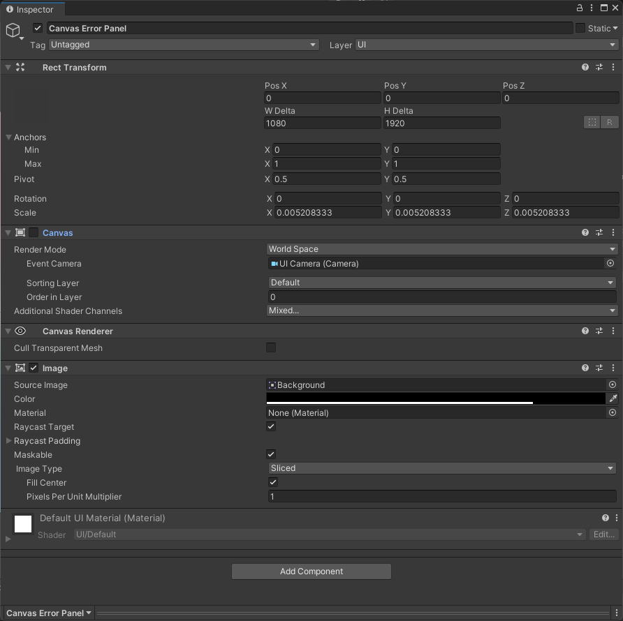
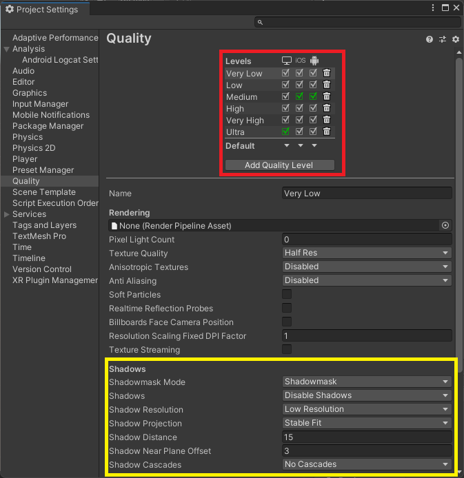
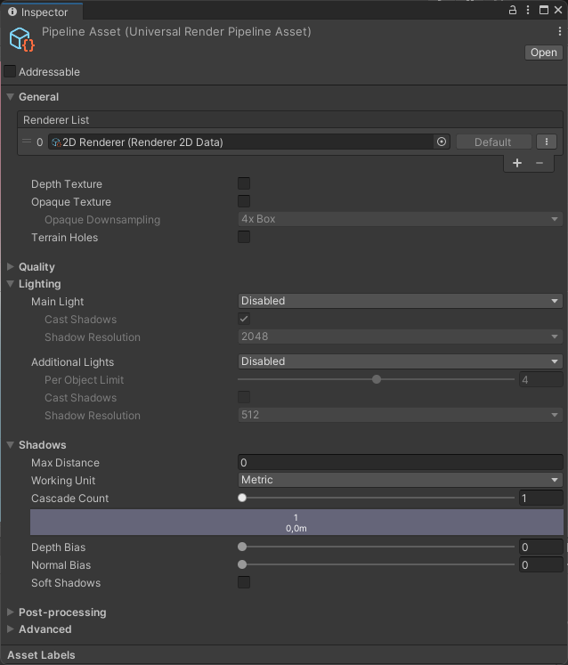
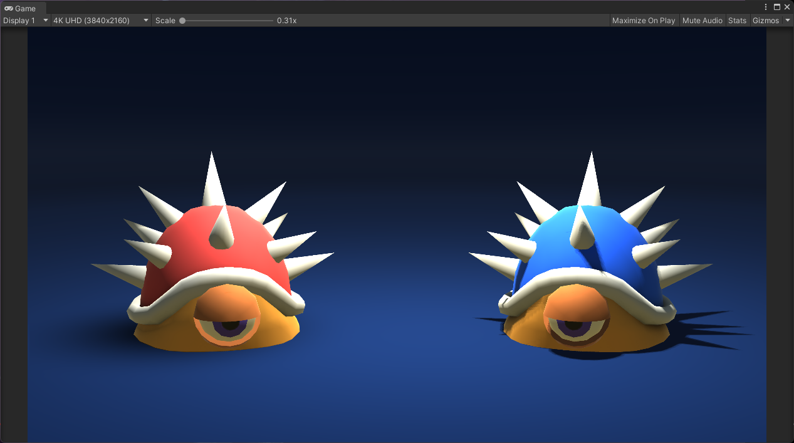

# Unity Performance Optimization - Part 2 : UI

  

Performance optimization is a real challenge for all videogames creators. Performances are even more important for Android or iOS projects. FPS drops, latency, lag, etc. disturb players's experience and discourage them to play once again. The variety and the wide selection of mobile devices combined with the diversity of hardaware and specification can make you giddy. This document provides **UI**, **Rendering** and **Profiling** advices to develop a top performance mobile 2D game.

Back to [Readme](../README.md)
Go to [Unity Performance Optimization - Part 2 : Unity Tips & Code Architecture](Unity-Performance-Optimization-Part2)

## Table of contents
* [Prerequisites](#prerequisites)
* [Profiling](#profiling)
* [UI](#ui-adjustment)
* [Rendering](#rendering)
  * [Lights](#lights)
  * [Shadows](#shadows)
  * [Quality](#quality)
  * [Frame Rate and Resolution](#frame-rate-and-resolution)
* [Unity tips](#unity-tips)
  * [Scene](#scene)
  * [Player Settings](#player-settings)
  * [Editor](#editor)
  * [Resources](#resources)
* [Code architecture](#code-architecture)

## Prerequisites

* [Unity](https://unity3d.com/fr/get-unity/download) installed (ideally a LTS version) with the modules **Android SDK & NDK tools**, **OpenJDK** and **iOS Build Support**
* [USB debugging](https://developer.android.com/studio/debug/dev-options) or [Wireless debugging (Android 11+) or ADB over network enable (Android 10 and lower)](https://developer.android.com/studio/command-line/adb) enabled on the device

## Profiling

The Unity Profiler provides **essential performance information** about Unity applications. It allows to see graphically how a game is doing, what takes time to compute, how long is the rendering per frame and which sections are absorbing your performances.

The Profiler need to be used at the **beginning** of the project and **often**. A performance signature allows to the developper to spot new issues more easly.

<p align="center">
	</br>
	<em>Unity Profiler window</em>
</p>

Profiling on **different devices** gives the opportunity to gain more **accurate insights**. It's important to profile and optimize for **both the highest and lowest** specifity devices targeted.


To display the Unity Profiler go to *Window > Profiler*. Then, build the application with **Development Build** and **Autoconnect profiler** enabled. Finally, connect the device to the computer, launch the Unity application on your device and press the button *Record* in the Profiler window.

<p align="center">
	</br>
	<em>Build Settings options</em>
</p>


> WARNING
> 
> The **Autoconnect profiler** option can not work and avoid the connection between Unity and devices. If the Profiler doesn't detect devices, disable the **Autoconnect profiler** in Build Settings can correct this problem. However, devices should be **connect manually**.


To learn more about how to configure, use and interpret Unity Profiler, go read the article [Optimize your mobile game performance from Unity’s top engineers](https://blog.unity.com/technology/optimize-your-mobile-game-performance-tips-on-profiling-memory-and-code-architecture)

</br>

## UI

* Use the package **TextMeshPro** (TMP). 

It's the perfect replacement for Unity's UI Text. Since the geometry created by TextMeshPro uses two triangles per character just like Unity's text components, this improved visual quality and flexibility comes at no additional performance cost. TMP provides improved control over text formatting and layout. To download and install TMP package, go to *Window > Package Manager* and search *TextMeshPro* in the research bar.

<p align="center">
	</br>
	<em>TextMeshPro in Package Manager</em>
</p>

* Separate UI elements in subcanvaces. 

When an element is changed, the whole canvas is reanalyzed. Generating canvas meshes can be expensive. UI elements need to be collected into batches so that they’re drawn in as few draw calls as possible. Because batch generation is expensive, we want to regenerate them only when necessary.

<p align="center">
	 </br>
	<em>First Image : Canvas not separate | Second Image : Canvas separate</em>
</p>

* Hide invisible UI elements and invisible Canvas. 

Disable the entire canvas. If a certain group of elements have to disappear, group them on their own separate canvas.

<p align="center">
	 </br>
	<em>First Image : UI and canvas not hide | Second Image : UI and canvas hide</em>
</p>

* Disable the **canvas component**, not the game object itself.

Disabling the Canvas Component will stop the Canvas from issuing draw calls to the GPU, so the Canvas will not be visible any longer. However, the Canvas won’t discard its vertex buffer; it will keep all of its meshes and vertices, and when you re-enable it, it won’t trigger a rebuild, it will just start drawing them again.


<p align="center">
	</br>
	<em>Canvas component disabled</em>
</p>

* All elements in a canvas need to have the same **Pos Z** value.

The canvas components' layering is linked to their **position in the hierarchy** and the canvas' **Order in layer** value.

* Disable **Raycast Target** property for all non-interactive elements.

The Graphic Raycaster performs intersection checks on UI elements that are interested in receiving input. However, not all UI elements are interested in receiving updates.

<p align="center">
	</br>
	<em>Raycast Target disabled</em>
</p>

* **Group UI elements** instead of create an image for each one.

Create one large image (1024x1024 for example) with all the UI elements and applied a mesh filter to retrieve each individual piece from the image.

<p align="center">
	</br>
	<em>All windows (4000x5000)</em>
</p>

* Reduce the **frame rate** when it's possible.

When an UI contains none or few animations or shaders, reduce the frame rate to 30 frames per second. Simple UIs don't need to be refreshed as a same rate as the rest of game. *[Link to Code Arichitecture - Frame rate code](#link-to-code-architecture)* explains how change the frame rate with a C# Unity script.


</br>

## Rendering

### Lights

* Disable **Lighting** options.

	If you don't need any light in your game :
	
	* Delete all lights in your scene.
	* Go to *Window > Rendering > Lighting* and set up Lighting *Scene*, *Environment* and *Baked Lightmaps* like the pictures below.
	* If a **Render Pipeline Asset** is used, disabled all ligths options in the *Inspector*.

<p align="center">
	  </br>
	<em>Lighting - Scene, Environment & Baked Lightmaps</em>
</p>

* Avoid too many dinamyc lights.

If it possible, don't use dynamic lighting and prefer unlit textures. Lighting calculations take too much resources, espacially with many objects to render.

### Shadows

Shadows calculations need a lot of resources, espacially with many objects and ligths. Despite of your game, some behaviors may be choosen :

* Disable all shadows (no dinamyc lights):	
	* The game doesn't use a **Render Pipeline Asset** : *Edit > Project Settings > Quality* set up all **Quality Levels**.
	* The game uses a **Render Pipeline Asset** : select the *Render Pipeline Asset* in *Project* and edit the parameters in the *Inspector*.
	
<p align="center">
	 &nbsp; </br>
	<em>Shadows parameters in Project Settings and Render Pipeline</em>
</p>

* Disabled real-time shadows (dynamic lights). 

Anything real-time must be computed by the mobile device's CPU first before rendering and this will negatively impact games' performance. Instead, shadows can be directly drawing on 2D characters for example. Fake shadows can also be created by using a blurred texture applied to a simple mesh or quad underneath your characters. Otherwise, a blob shadows can be created with custom shaders.

<p align="center">
	 &nbsp; </br>
	<em>2D Drawing Shadows | Fake Shadows (red) VS Real Time Shadows (blue)</em>
</p>

* Keep shadows simple (dynamic lights). 

Be aware that what is displayed in the editor, it doesn’t represent what will be displayed on a device. For example, a Low Resolution Shadow setting could be perceived as really pixelated on a computer but could be enough on a device.

**Soft Shadows** demand more resources than **Hard Shadows**. The option *Hard Shadows Only* can be selected in *Edit > Project Settings > Quality* (don't forget to set-up each quality). But with this option, at a very low resolution the shadows are really pixelated and edgy. So, chosing the option *Close Fit* in *Shadow Projection* allows to have shadows less pixelated.


</br>

## Launching an application on Android devices from Windows

### Find the package and the activity

If you already know the name of the package and of the activity to [Launch and stop an application](#launch-and-stop-an-application).

* First step : to find the **package** installed on the device list all the packages present in the device

```bash
adb -s ipadd shell pm list packages
```

*Example*

```bash
> adb -s RF8M828XJEZ shell pm list packages
```

```diff
package:com.linkedin.android
package:com.android.settings
package:com.samsung.app.newtrim
package:com.samsung.android.dsms
package:com.samsung.android.fast
package:com.samsung.android.lool
package:com.samsung.android.app.notes
package:com.sec.android.app.bluetoothtest
package:com.sec.android.sdhms
package:com.samsung.android.app.spage
+ package:com.qiwy.com.ouat.life
package:com.samsung.android.wifi.softap.resources
package:com.samsung.android.samsungpositioning
package:com.android.statementservice
package:com.google.android.as
package:com.google.android.gm
```
> My package is named `com.qiwy.com.ouat.life` in the device.

</br>

* Second step : to find the **package activity** to launch list all the activities published by the package

```bash
adb -s ipadd shell #press Enter
dumpsys package | grep -Eo "^[[:space:]]+[0-9a-f]+[[:space:]]+com.package.name/[^[:space:]]+" | grep -oE "[^[:space:]]+$"
```

*Example*

```bash
> adb -s RF8M828XJEZ shell
> d2s:/ $ dumpsys package | grep -Eo "^[[:space:]]+[0-9a-f]+[[:space:]]+com.qiwy.com.ouat.life/[^[:space:]]+" | grep -oE "[^[:space:]]+$"
```

```diff
com.qiwy.com.ouat.life/com.facebook.CustomTabActivity
com.qiwy.com.ouat.life/com.google.firebase.auth.internal.GenericIdpActivity
com.qiwy.com.ouat.life/com.google.firebase.auth.internal.RecaptchaActivity
+ com.qiwy.com.ouat.life/com.unity3d.player.UnityPlayerActivity
com.qiwy.com.ouat.life/com.facebook.CurrentAccessTokenExpirationBroadcastReceiver
com.qiwy.com.ouat.life/com.unity.androidnotifications.UnityNotificationRestartOnBootReceiver
com.qiwy.com.ouat.life/com.google.firebase.auth.api.fallback.service.FirebaseAuthFallbackService
d2s:/ $
```
> The package `com.qiwy.com.ouat.life` contains the activity `com.qiwy.com.ouat.life/com.unity3d.player.UnityPlayerActivity`. This activity allows to start the game.

### Launch and stop an application

* To launch an application

```bash
adb -s ipadd shell am start -n com.package.name/com.activity.name
```

*Example*

```bash
> adb -s RF8M828XJEZ shell am start -n com.qiwy.com.ouat.life/com.unity3d.player.UnityPlayerActivity
```

</br>

* To stop an application

```bash
adb -s ipadd shell am force-stop com.package.name
```

*Example*

```bash
> adb -s RF8M828XJEZ shell am force-stop com.qiwy.com.ouat.life
```
