# Unity Performance Optimization - Part 3 : Rendering

 


Performance optimization is a real challenge for all videogames creators. Performances are even more important for Android or iOS projects. FPS drops, latency, lag, etc. disturb players's experience and discourage them to play once again. The variety and the wide selection of mobile devices combined with the diversity of hardaware and specification can make you giddy. This guide provides *Profiling, *UI*, *Rendering*, *Code Architecture* and *Global Unity* advices to develop a top performance 2D mobile game.

 > This part is focused on **Rendering**

Back to [Readme](../README.md) or go to [Unity Performance Optimization - Part 4 : Unity Tips](Unity-Performance-Optimization-Part4.md)

## Table of contents
* [Prerequisites](#prerequisites)
* [Rendering](#rendering)
  * [Lights](#lights)
  * [Shadows](#shadows)
  * [Quality](#quality)
  * [Frame Rate and Resolution](#frame-rate-and-resolution)

## Prerequisites

* [Unity](https://unity3d.com/fr/get-unity/download) installed (ideally a LTS version) with the modules **Android SDK & NDK tools**, **OpenJDK** and **iOS Build Support**
* [USB debugging](https://developer.android.com/studio/debug/dev-options) or [Wireless debugging (Android 11+) or ADB over network enable (Android 10 and lower)](https://developer.android.com/studio/command-line/adb) enabled on the device

## Rendering

### Lights

* Disable **Lighting** options.

	If you don't need any light in your game :
	
	* Delete all lights in your scene.
	* Go to *Window > Rendering > Lighting* and set up Lighting *Scene*, *Environment* and *Baked Lightmaps* like the pictures below.
	* If a **Render Pipeline Asset** is used, disabled all ligths options in the *Inspector*.

<p align="center">
	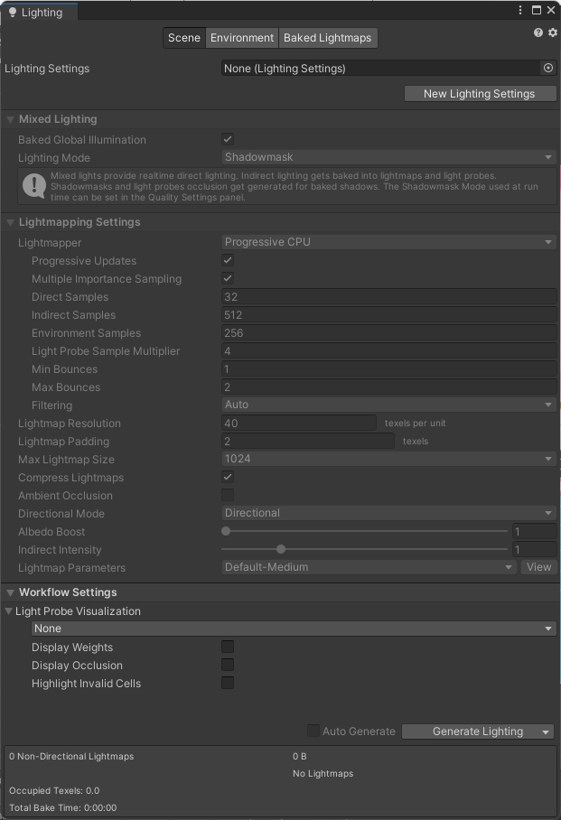 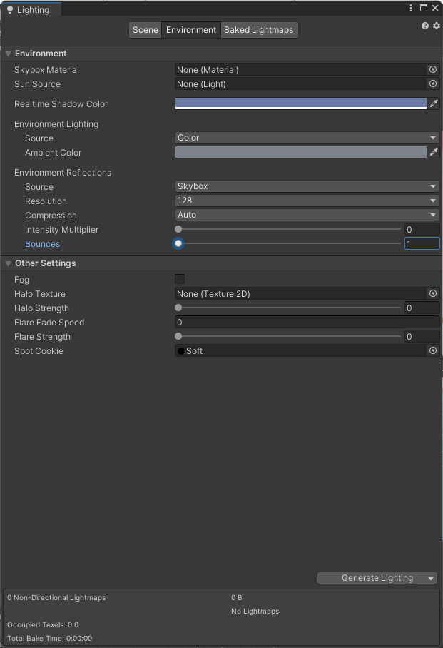 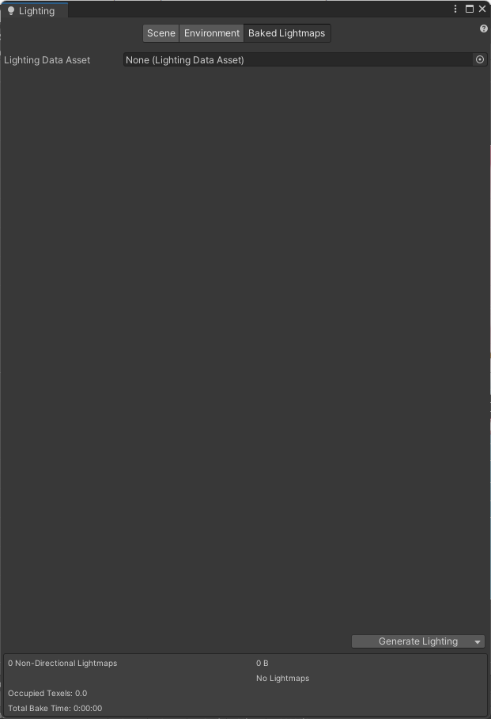</br>
	<em>Lighting - Scene, Environment & Baked Lightmaps</em>
</p>

* Avoid too many dinamyc lights.

If it possible, don't use dynamic lighting and prefer unlit textures. Lighting calculations take too much resources, espacially with many objects to render.

</br>

### Shadows

Shadows calculations need a lot of resources, espacially with many objects and ligths. According to your game, some behaviors may be choosen :

* Disable all shadows (no dinamyc lights):	
	* The game doesn't use a **Render Pipeline Asset** : *Edit > Project Settings > Quality* set up all **Quality Levels**.
	* The game uses a **Render Pipeline Asset** : select the *Render Pipeline Asset* in *Project* and edit the parameters in the *Inspector*.
	
<p align="center">
	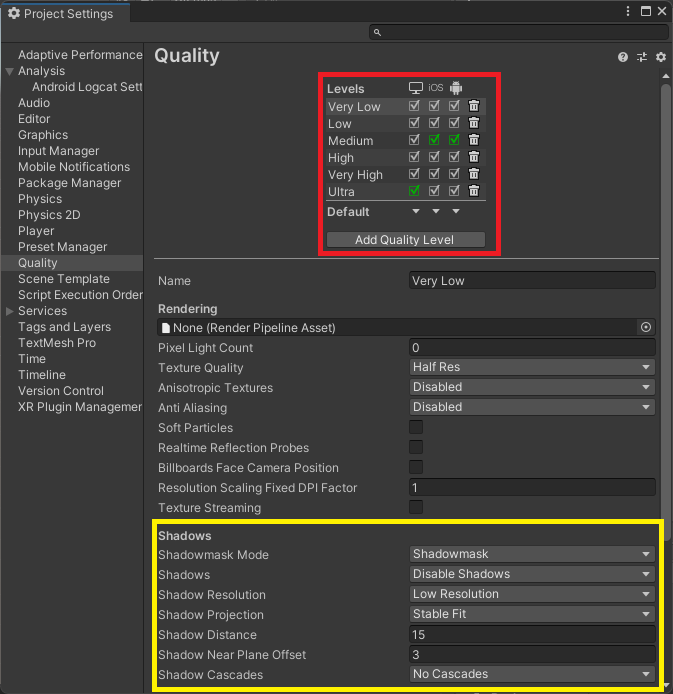 &nbsp; 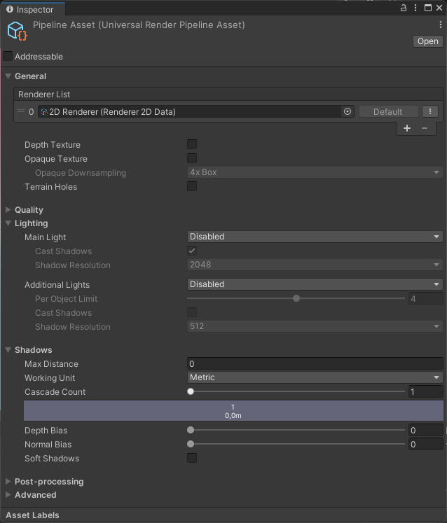</br>
	<em>Shadows parameters in Project Settings and Render Pipeline</em>
</p>

* Disabled **real-time shadows** (dynamic lights). 

Anything real-time must be computed by the mobile device's CPU first before rendering and this will negatively impact games' performance. Instead, shadows can be directly drawing on 2D characters for example. Fake shadows can also be created by using a blurred texture applied to a simple mesh or quad underneath your characters. Otherwise, a blob shadows can be created with custom shaders.

<p align="center">
	 &nbsp; 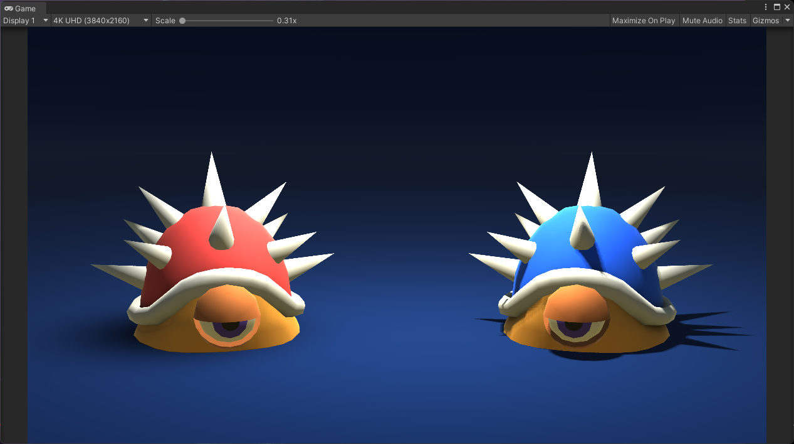</br>
	<em>2D Drawing Shadows | Fake Shadows (red) VS Real Time Shadows (blue)</em>
</p>

* Keep shadows **simple** (dynamic lights). 

Be aware that what is displayed in the editor, it doesn’t represent what will be displayed on a device. For example, a Low Resolution Shadow setting could be perceived as really pixelated on a computer but could be enough on a device.

**Soft Shadows** demand more resources than **Hard Shadows**. The option *Hard Shadows Only* can be selected in *Edit > Project Settings > Quality* (don't forget to set-up each quality). But with this option, at a very low resolution the shadows are really pixelated and edgy. So, chosing the option *Close Fit* in *Shadow Projection* allows to have shadows less pixelated. In the same window, set the *Shadow Cascades* to *No Cascades*. Finally, reduce the *Shadow Distance* value. This value represents the distance at which the shadows are processed. Shadows beyond this distance aren’t calculated

<p align="center">
	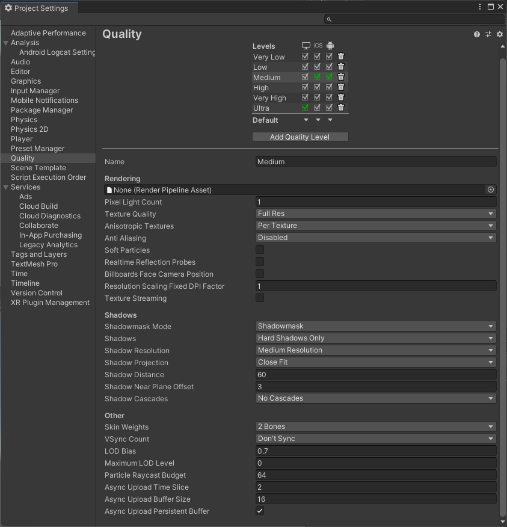 </br>
	<em>Simple Shadows Settings</em>
</p>

</br>

### Quality

* Enable **Multithreaded Rendering**

Multithreaded rendering in Unity is implemented as a single client, single worker thread. This works by taking advantage of the abstract GfxDevice interface in Unity. The different graphics API implementations, (such as Vulkan, Metal, and GLES) inherit from the GfxDevice.

To enable the multithreaded rendering, go to *Edit > Project Settings > Player*, scroll down and check the *Multithreaded Renderin checkbox.

<p align="center">
	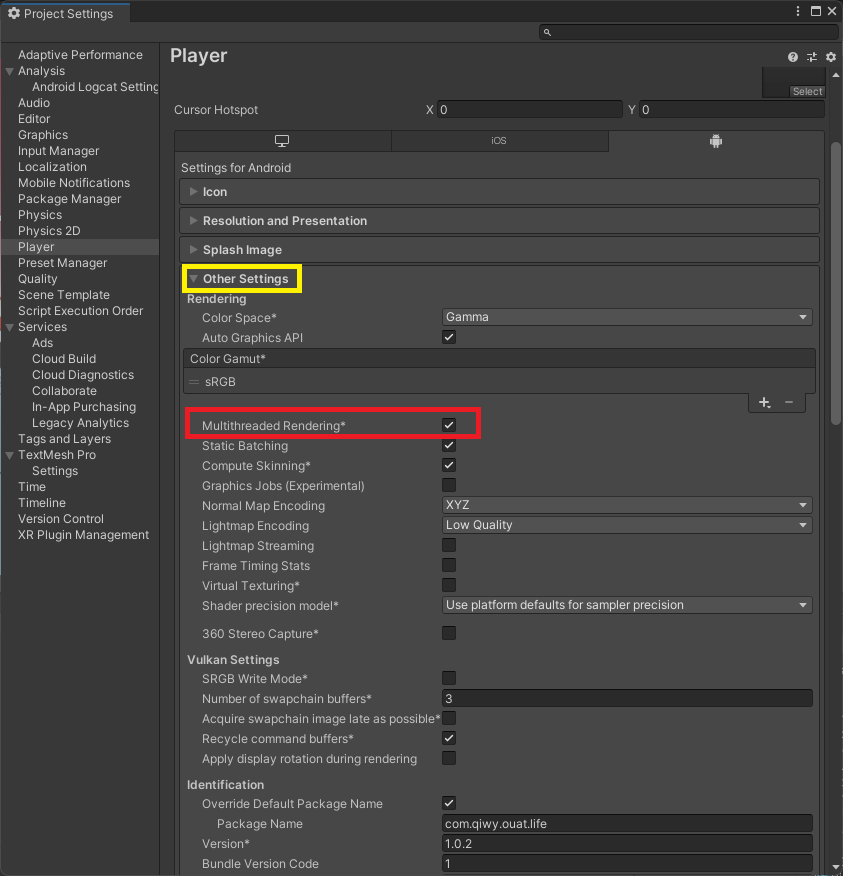 </br>
	<em>Multithreaded Rendering Settings</em>
</p>

Unity enables or disables Multithreaded Rendering conditionally, depending on the graphics API and target platform. The following table provides an overview of what platforms and Graphics API you can enable or disable Multithreaded Rendering.

<p align="center">
	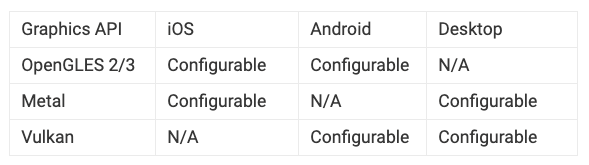 </br>
	<em>Multithreaded Overview</em>
</p>

Multithreaded Rendering should enable whenever possible, as it usually benefits performance greatly. The using of Multithreaded Rendering also should be profile, and be aware that on very low-end devices there might be little to no benefit.

* Disable needless **Quality Levels**

Go to *Edit > Project Settings > Quality*, and disable or delete needless **quality levels** and setup **default quality** depending on the devices.

<p align="center">
	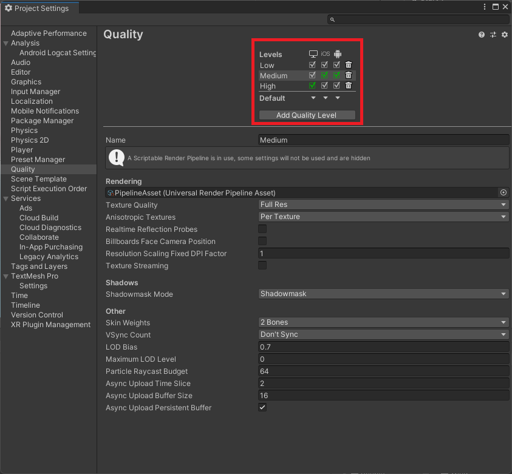 </br>
	<em>Quality Settings</em>
</p>

* Create **Pipeline Assets** for each quality

A render pipeline performs a series of operations that take the contents of a Scene, and displays them on a screen. For mobile devices, the Universal Render Pipeline (URP) is the best option. URP provides artist-friendly workflows that let you quickly and easily create optimized graphics across a range of platforms, from mobile to high-end consoles and PCs. Don't forget to set-up each pipeline according to the quality

* Enable **SRP** & limit **Post-Processing**

If you used pipeline assets, it's important to set-up them correctly, especially the **Low Level Quality**.

First step is to enable *SRP Batcher*. Go to the *Pipeline Asset - Inspector > Advanced > SRP Batcher*. The Scriptable Render Pipeline (SRP) Batcher is a draw call optimization that significantly improves performance for applications that use an SRP. The SRP Batcher reduces the CPU time Unity requires to prepare and dispatch draw calls for materials that use the same shader variant.

Second step is limit **Post-Processing** effects. Fullscreen **Post-Processing effects**, like glows, can dramatically slow down performance. Use them cautiously.

<p align="center">
	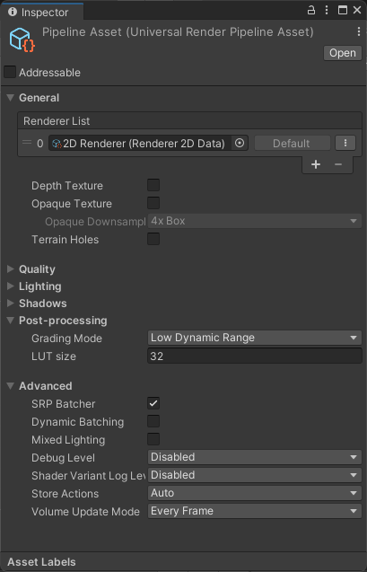 </br>
	<em>Post-Processinf Inspector</em>
</p>

</br>

### Frame Rate and Resolution

* Choose the right **frame rate** in despite of the scene

A dynamic scene with many animations, movements, shaders, etc. needs **60 FPS** (Frames Per Seconde) at least. A static scene like UI scenes for example needs only **30 FPS**.

To change the frame rate of a scene, create a script or add in an existing script the function below :

```cs
public int frameRate; //Enter the desired frame rate's value in the inspector 

void Awake()
{
	Application.targetFrameRate = frameRate;
}
```

* Avoid **mobile native resolution**

Newer devices allows to display very high resolutions. To gain some performance, use *Screen.SetResolution(int width, int height, bool fullscreenMode)* function in the *Start* of a script. It's important to allow the player to switch between different resolutions in the parameters. Profile multiple resolutions to find the best balance between quality and speed.

```cs
void Start()
{
	Screen.SetResolution(width, height, false);
}
```

</br>

---

Back to [Readme](../README.md) or go to [Unity Performance Optimization - Part 4 : Unity Tips](Unity-Performance-Optimization-Part4.md)