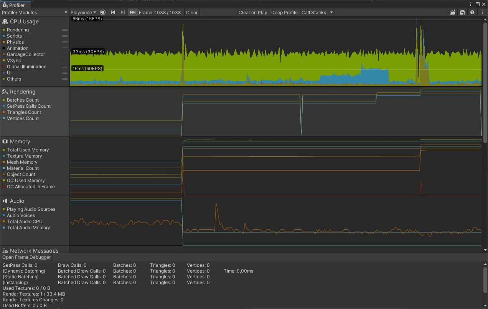
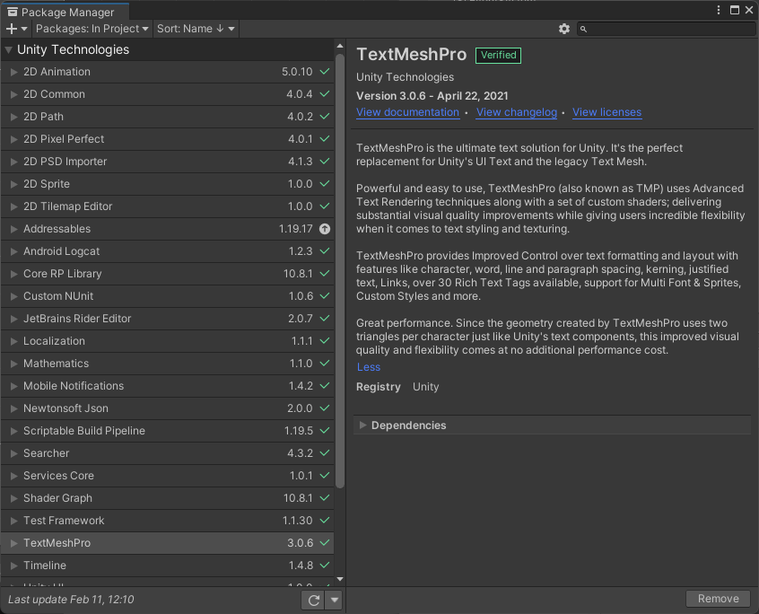

# Unity Performance Optimization

  

Performance optimization is a real challenge for all videogames creators. Performances are even more important for Android or iOS projects. FPS drops, latency, lag, etc. disturb players's experience and discourage them to play once again. The variety and the wide selection of mobile devices combined with the diversity of hardaware and specification can make you giddy. This document provides code architecture, Unity tips and profiling to develop a top performance mobile 2D game.

Back to [Readme](../README.md)

## Table of contents
* [Prerequisites](#prerequisites)
* [Profiling](#profiling)
* [UI](#ui-adjustment)
* [Rendering](#rendering)
  * [Lights](#lights)
  * [Shadows](#shadows)
  * [Quality](#quality)
  * [Frame Rate and Resolution](#frame-rate-and-resolution)
* [Unity tips](#unity-tips)
  * [Scene](#scene)
  * [Player Settings](#player-settings)
  * [Editor](#editor)
  * [Resources](#resources)
* [Code architecture](#code-architecture)

## Prerequisites

* [Unity](https://unity3d.com/fr/get-unity/download) installed (ideally a LTS version) with the modules **Android SDK & NDK tools**, **OpenJDK** and **iOS Build Support**
* [USB debugging](https://developer.android.com/studio/debug/dev-options) or [Wireless debugging (Android 11+) or ADB over network enable (Android 10 and lower)](https://developer.android.com/studio/command-line/adb) enabled on the device

## Profiling

The Unity Profiler provides **essential performance information** about Unity applications. It allows to see graphically how a game is doing, what takes time to compute, how long is the rendering per frame and which sections are absorbing your performances.

The Profiler need to be used at the **beginning** of the project and **often**. A performance signature allows to the developper to spot new issues more easly.

<p align="center">
	</br>
	<em>Unity Profiler window</em>
</p>

Profiling on **different devices** gives the opportunity to gain more **accurate insights**. It's important to profile and optimize for **both the highest and lowest** specifity devices targeted.


To display the Unity Profiler go to *Window > Profiler*. Then, build the application with **Development Build** and **Autoconnect profiler** enabled. Finally, connect the device to the computer, launch the Unity application on your device and press the button *Record* in the Profiler window.

<p align="center">
	</br>
	<em>Build Settings options</em>
</p>


> WARNING
> 
> The **Autoconnect profiler** option can not work and avoid the connection between Unity and devices. If the Profiler doesn't detect devices, disable the **Autoconnect profiler** in Build Settings can correct this problem. However, devices should be **connect manually**.


To learn more about how to configure, use and interpret Unity Profiler, go read the article [Optimize your mobile game performance from Unity’s top engineers](https://blog.unity.com/technology/optimize-your-mobile-game-performance-tips-on-profiling-memory-and-code-architecture)

</br>

## UI

* Use the package **TextMeshPro** (TMP). 

It's the perfect replacement for Unity's UI Text. Since the geometry created by TextMeshPro uses two triangles per character just like Unity's text components, this improved visual quality and flexibility comes at no additional performance cost. TMP provides improved control over text formatting and layout. To download and install TMP package, go to *Window > Package Manager* and search *TextMeshPro* in the research bar.

<p align="center">
	</br>
	<em>TextMeshPro in Package Manager</em>
</p>

* Separate UI elements in subcanvaces. 

When an element is changed, the whole canvas is reanalyzed. Generating canvas meshes can be expensive. UI elements need to be collected into batches so that they’re drawn in as few draw calls as possible. Because batch generation is expensive, we want to regenerate them only when necessary.

<p align="center">
	 </br>
	<em>First Image : Canvas not separate | Second Image : Canvas separate</em>
</p>

</br>

## Installing an application on Android devices from Windows

### Step by step with shell

* To copy a file **from a specific directory** to a device

```bash
adb -s ipadd push local remote
```

* To copy a file **from a device** to a specific directory

```bash
adb -s ipadd pull local remote
```

* To **install** an .apk in a device from the **shell**

```bash
adb -s ipadd shell pm install path
```

### The ULTIMATE command

* **Push** and **install** at the same time

```bash
adb -s ipadd install -r name.apk
```

```bash
Options
-l: Install the package with forward lock.
-r: Reinstall an existing app, keeping its data.
-t: Allow test APKs to be installed.
-i <INSTALLER_PACKAGE_NAME>: Specify the installer package name.
-s: Install package on the shared mass storage (such as sdcard).
-f: Install package on the internal system memory.
-d: Allow version code downgrade.

uninstall [options] <PACKAGE>   Removes a package from the system.

Options:
-k: Keep the data and cache directories around after package removal.
```

</br>

## Launching an application on Android devices from Windows

### Find the package and the activity

If you already know the name of the package and of the activity to [Launch and stop an application](#launch-and-stop-an-application).

* First step : to find the **package** installed on the device list all the packages present in the device

```bash
adb -s ipadd shell pm list packages
```

*Example*

```bash
> adb -s RF8M828XJEZ shell pm list packages
```

```diff
package:com.linkedin.android
package:com.android.settings
package:com.samsung.app.newtrim
package:com.samsung.android.dsms
package:com.samsung.android.fast
package:com.samsung.android.lool
package:com.samsung.android.app.notes
package:com.sec.android.app.bluetoothtest
package:com.sec.android.sdhms
package:com.samsung.android.app.spage
+ package:com.qiwy.com.ouat.life
package:com.samsung.android.wifi.softap.resources
package:com.samsung.android.samsungpositioning
package:com.android.statementservice
package:com.google.android.as
package:com.google.android.gm
```
> My package is named `com.qiwy.com.ouat.life` in the device.

</br>

* Second step : to find the **package activity** to launch list all the activities published by the package

```bash
adb -s ipadd shell #press Enter
dumpsys package | grep -Eo "^[[:space:]]+[0-9a-f]+[[:space:]]+com.package.name/[^[:space:]]+" | grep -oE "[^[:space:]]+$"
```

*Example*

```bash
> adb -s RF8M828XJEZ shell
> d2s:/ $ dumpsys package | grep -Eo "^[[:space:]]+[0-9a-f]+[[:space:]]+com.qiwy.com.ouat.life/[^[:space:]]+" | grep -oE "[^[:space:]]+$"
```

```diff
com.qiwy.com.ouat.life/com.facebook.CustomTabActivity
com.qiwy.com.ouat.life/com.google.firebase.auth.internal.GenericIdpActivity
com.qiwy.com.ouat.life/com.google.firebase.auth.internal.RecaptchaActivity
+ com.qiwy.com.ouat.life/com.unity3d.player.UnityPlayerActivity
com.qiwy.com.ouat.life/com.facebook.CurrentAccessTokenExpirationBroadcastReceiver
com.qiwy.com.ouat.life/com.unity.androidnotifications.UnityNotificationRestartOnBootReceiver
com.qiwy.com.ouat.life/com.google.firebase.auth.api.fallback.service.FirebaseAuthFallbackService
d2s:/ $
```
> The package `com.qiwy.com.ouat.life` contains the activity `com.qiwy.com.ouat.life/com.unity3d.player.UnityPlayerActivity`. This activity allows to start the game.

### Launch and stop an application

* To launch an application

```bash
adb -s ipadd shell am start -n com.package.name/com.activity.name
```

*Example*

```bash
> adb -s RF8M828XJEZ shell am start -n com.qiwy.com.ouat.life/com.unity3d.player.UnityPlayerActivity
```

</br>

* To stop an application

```bash
adb -s ipadd shell am force-stop com.package.name
```

*Example*

```bash
> adb -s RF8M828XJEZ shell am force-stop com.qiwy.com.ouat.life
```
